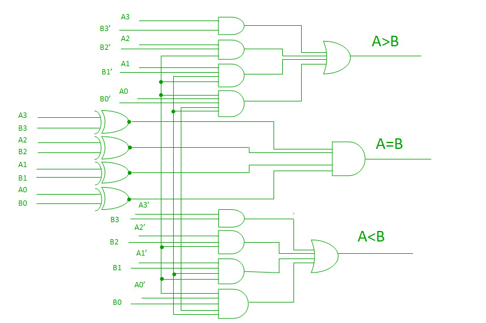

# Four-Bit-Magnitude-Comparator
## Title 
### Design and simulate 4 bit magnitude comparator using Verilog
## Aim
### To design and simulate 4 bit magnitude comparator using Verilog
## Introduction
A comparator used to compare two binary numbers each of four bits is called a 4-bit magnitude comparator. It consists of eight inputs each for two four-bit numbers and three outputs to generate less than, equal to, and greater than between two binary numbers.
### Logic Diagram

### Logical Expression
#### For A = B
E = (A3 ⊙ B3)(A2 ⊙ B2)(A1 ⊙ B1)(A0 ⊙ B0)
#### For A > B
G = (A3 ¬B3) + (A3 ⊙ B3)(A2 ¬B2) + (A3 ⊙ B3)(A2 ⊙ B2)(A1 ¬B1) + (A3 ⊙ B3)(A2 ⊙ B2)(A1 ⊙ B1)(A0 ¬B0)
#### For A < B
L = (¬A3 B3) + (A3 ⊙ B3)(¬A2 B2) + (A3 ⊙ B3)(A2 ⊙ B2)(¬A1 B1) + (A3 ⊙ B3)(A2 ⊙ B2)(A1 ⊙ B1)(¬A0 B0)
### Block Diagram

### Truth Table

## Explanation
In a 4-bit comparator the condition of A>B can be possible in the following four cases: 
 
1. If A3 = 1 and B3 = 0
2. If A3 = B3 and A2 = 1 and B2 = 0
3. If A3 = B3, A2 = B2 and A1 = 1 and B1 = 0
4. If A3 = B3, A2 = B2, A1 = B1 and A0 = 1 and B0 = 0

Similarly the condition for A<B can be possible in the following four cases: 

1. If A3 = 0 and B3 = 1
2. If A3 = B3 and A2 = 0 and B2 = 1
3. If A3 = B3, A2 = B2 and A1 = 0 and B1 = 1
4. If A3 = B3, A2 = B2, A1 = B1 and A0 = 0 and B0 = 1

The condition of A=B is possible only when all the individual bits of one number exactly coincide with corresponding bits of another number.
## Program
```
module four_bit_mag_comp(eq, gr, lw, a3, a2, a1, a0, b3, b2, b1, b0);
input a3, a2, a1, a0, b3, b2, b1, b0;
output eq, gr, lw;
wire z3, z2, z1, z0, y3, y2, y1, y0, x3, x2, x1, x0, n_a3, n_a2, n_a1, n_b3, n_b2, n_b1;

xnor(z3, a3, b3);
xnor(z2, a2, b2);
xnor(z1, a1, b1);
xnor(z0, a0, b0);

and(y3, a3, !b3);
and(y2, a2, !b2);
and(y1, a1, !b1);
and(y0, a0, !b0);

and(n_a3, z3, y2);
and(n_a2, z3, z2, y1);
and(n_a1, z3, z2, z1, y0);

and(x3, !a3, b3);
and(x2, !a2, b2);
and(x1, !a1, b1);
and(x0, !a0, b0);

and(n_b3, z3, x2);
and(n_b2, z3, z2, x1);
and(n_b1, z3, z2, z1, x0);

and(eq, z3, z2, z1, z0);
or(gr, y3, n_a3, n_a2, n_a1);
or(lw, x3, n_b3, n_b2, n_b1);

endmodule
```
### RTL Diagram

### Timing Diagram

## Result
Thus the implementation of 4 bit magnitude comparator using Verilog is verified.
